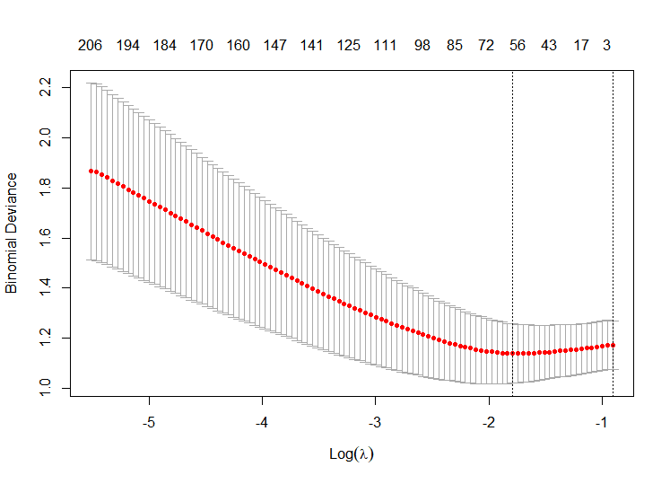

# Introduction

Obesity stands as a significant public health concern. Citing research
by Lavie and others, there’s been a noticeable uptick in obesity rates
across the United States and much of the Western world in recent years,
leading to a global epidemic. Obesity aggravates several risk factors
for cardiovascular diseases (CVD), consequently elevating the incidence
of conditions such as hypertension, coronary artery disease, heart
failure, and atrial fibrillation \[1\]\[2\]. This study seeks to unravel
the genetic contributors to obesity by analyzing DNA methylation in
saliva samples from Latino preschool children, which could pave the way
for precise intervention strategies including specialized medications
and metabolic adjustments.

# Data

The DNA methylation profiles in saliva from 96 mother-child pairs were
obtained from the NCBI Gene Expression Omnibus (GEO) database ([Click
here](https://www.ncbi.nlm.nih.gov/geo/query/acc.cgi?acc=GSE72556)),
with the accession code GSE72556. This methylation data was acquired
using the Illumina HumanMethylation450 BeadChip platform.

# Method and Results

## Data Cleaning

The dataset comprises two text files: a dictionary linking CpG sites to
genes, and the main data file with 96 samples and over 480,000 CpG site
columns. We utilized the data.table package for efficient data handling.
Three samples were excluded due to participant withdrawal. Cluster
analysis identified and removed an outlier. We then discarded columns
with over 20% missing values to enhance model accuracy and imputed
remaining missing data using the KNN algorithm.

## KNN Imputation

KNN imputation with K = 10 was optimal, as shown in figure 1, resulting
in a final dataset of 92 observations and 364,230 CpG sites. Children
were categorized into obese and normal groups based on the International
Obesity Task Force (IOTF) BMI cutoffs ([Details
here](https://onlinelibrary.wiley.com/doi/10.1111/j.2047-6310.2012.00064.x)),
where a 3 years old boy with BMI less than 17.69 is classified as
normal, etc.. The division according to IOTF indexes resulted in 25
obese and 67 normal-weight children.

K value vs. Number of Genes selected by Elastic Net

## Elastic Net

### Best Parameter: Alpha

We use BH (Benjamini-Hochberg) method and cutoff equals 0.1 to find the
best alpha value. Figure 2 indicates that an *α* value of 0.5 in Elastic
Net maximizes pathway identification in KEGG analysis and the effect of
different alpha values on GO enrichment results. In order to get results
from both enrichment analysis, we select *α* = 0.5 for future analysis.

Alpha value vs. Number of enriched terms. KEGG on the left, GO on the
right

### Best Parameter: Lambda

Then, we use 10-fold corss validation to find the best lambda. Figure 3
aids in selecting the most appropriate lambda value by using 10-fold
cross validation, correlating it with residuals in the Elastic Net model
(best *λ* = 0.167).

ten fold cross validation to select best lambda value

### Regression Coefficients and Selected Genes

Elastic Net Regularization was applied for predictor selection, followed
by KEGG and GO enrichment analysis to identify gene patterns. The table
of Elastic net regression is shown below. The Gene column are provided
by the dictionary provided along with the dataset.
## Enrichment Analysis: KEGG and GO

Enrichment analyses yielded various pathways: KEGG analysis pointed to
protein digestion and absorption (p.adjust = 0.0897), while GO analysis
identified actin filament binding, transmembrane transporter binding,
actin binding, and voltage-gated potassium channel activity (p.adjust
between 0.1 and 0.05).

results of Enrichment analysis. KEGG on the left, GO on the right

# Discussion

## Protein Digestion and Absorption

The methylation status of CpG islands might affect the expression of
enzymes related to protein digestion, such as pancreatic proteases or
gastric proteases. In children, changes in the activity of these enzymes
might impact the effective breakdown of proteins and absorption of amino
acids, thereby affecting growth and development. Altering the
methylation status of specific genes might change the pathways of
protein metabolism and its long-term impact on child health.

## Actin Filament Binding

Actin filaments play a key role in cell morphology and movement,
functions that are also important in intracellular transport and cell
signaling. Changes in actin-binding proteins may affect the internal
transport of substances in cells, including the transport of nutrients,
potentially impacting cellular metabolic activities and energy balance.

## Transmembrane Transporter Binding

Transmembrane transporters are responsible for the transport of
substances inside and outside the cell, including nutrients, metabolic
wastes, and signaling molecules. This suggests that methylation changes
might affect cellular uptake and metabolism of nutrients, especially in
energy balance and the development of obesity.

## Voltage-Gated Potassium Channel Activity

Voltage-gated potassium channels play a key role in maintaining cell
potential and signal transduction. Changes in the activity of these
channels might affect the functioning of the nervous system, including
the regulation of appetite and energy expenditure, an important aspect
in obesity research.

The Elastic Net analysis of saliva samples in our study has notably
aligned with existing literature on PubMed, reaffirming the reliability
of this method in identifying CpG islands associated with obesity and
protein metabolism. This consistency underscores the effectiveness of
Elastic Net in pinpointing potential epigenetic markers in children.
Such markers play a crucial role in understanding how genetic
predispositions to obesity and metabolic disorders manifest in early
childhood.

While Elastic Net provides a robust framework for our analysis, it’s
imperative to acknowledge certain limitations. The size of our sample,
although adequate for preliminary findings, may limit the
generalizability of our results. Additionally, the statistical power of
our study could be further enhanced with a larger cohort, offering more
definitive conclusions. There’s also the potential for biases inherent
in any observational study, which should be considered when interpreting
our findings.

Our research paves the way for future studies to delve deeper into the
relationship between specific methylation patterns of CpG islands and
various nutritional statuses. By extending this research to include
children from diverse age groups and backgrounds, we can gain a more
comprehensive understanding of how these epigenetic patterns vary or
remain consistent across different demographics. Such studies could
profoundly impact our understanding of childhood nutrition and health
risks, potentially influencing public health policies by providing
evidence-based guidelines for dietary and lifestyle modifications.

One of the most promising aspects of our study is the use of saliva as a
non-invasive medium for identifying potential biomarkers of obesity and
metabolic dysfunction \[3\]. The ease of collecting saliva makes it a
highly accessible tissue for large-scale screenings and longitudinal
studies. This could be instrumental in the early detection of children
at risk, offering a window for timely intervention and possibly altering
the trajectory towards obesity and related metabolic disorders.

In conclusion, our study not only reaffirms the utility of Elastic Net
in epigenetic research but also opens new avenues for understanding and
combating childhood obesity. By leveraging saliva samples for
non-invasive testing and focusing on early-life epigenetic changes, we
stand at the cusp of a transformative approach in addressing one of the
most pressing public health challenges of our time. The potential for
these findings to inform public health policies and individualized
interventions could have lasting impacts on the health trajectories of
children globally.

# Contributions

Liancheng Lu: was responsible for the finding of dataset, part of the
project codes. Haoyi Zheng: was resonsible for the plotting of the
project codes. Yue Yu: was responsible for the presentation and the
final report.

# Repository

The work directory of this entire project has been published on a Github
repository, which can be accessed here: [Click
here](https://github.com/lianchenglu/biostat625_final_project).

# Reference

1.  Carl J. Lavie, Alban De Schutter, Parham Parto, Eiman Jahangir,
    Peter Kokkinos, Francisco B. Ortega, Ross Arena, Richard V. Milani,
    Obesity and Prevalence of Cardiovascular Diseases and Prognosis—The
    Obesity Paradox Updated, Progress in Cardiovascular Diseases, Volume
    58, Issue 5, 2016, Pages 537-547, ISSN 0033-0620,
    <https://doi.org/10.1016/j.pcad.2016.01.008>.
    (<https://www.sciencedirect.com/science/article/pii/S0033062016300081>)

2.  Ortega FB, Lavie CJ, Blair SN. Obesity and cardiovascular disease.
    Circ Res. 2016. doi: 10.1161/CIRCRESAHA.115.306883.
    (<https://doi.org/10.1161/CIRCRESAHA.115.306883>)

3.  Oelsner, Kathryn Tully; Guo, Yan, To; Sophie Bao-Chieu; Non, Amy L.;
    Barkin, Shari L.. 2017, 2017/01/09. Maternal BMI as a predictor of
    methylation of obesity-related genes in saliva samples from
    preschool-age Hispanic children at-risk for obesity. BMC Genomics.
    <https://doi.org/10.1186/s12864-016-3473-9>. Doi:
    10.1186/s12864-016-3473-9.
